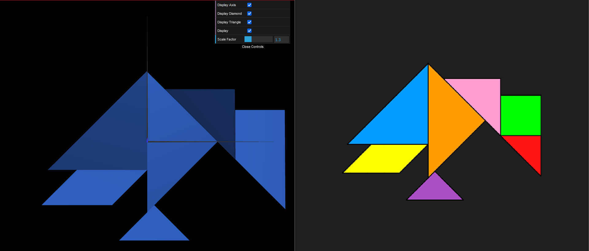
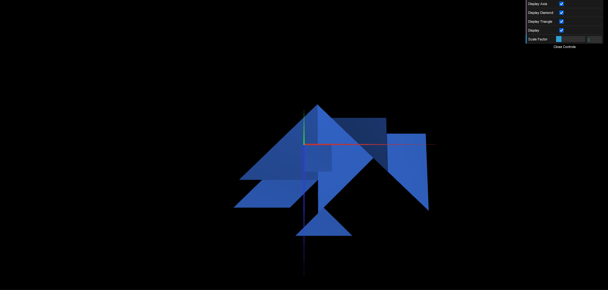
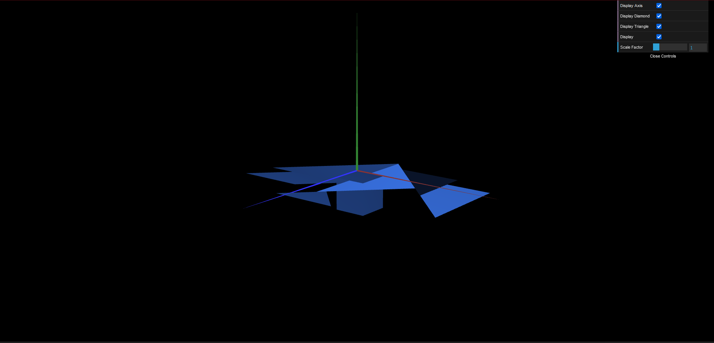
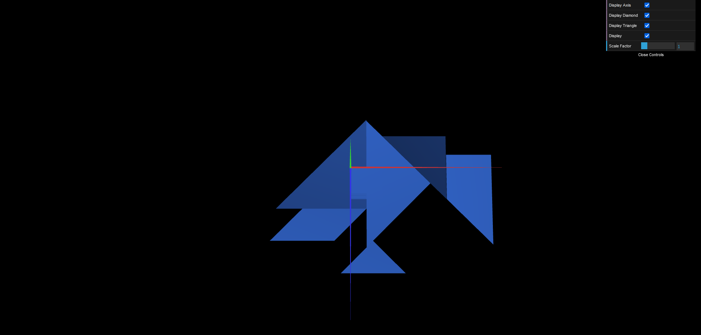
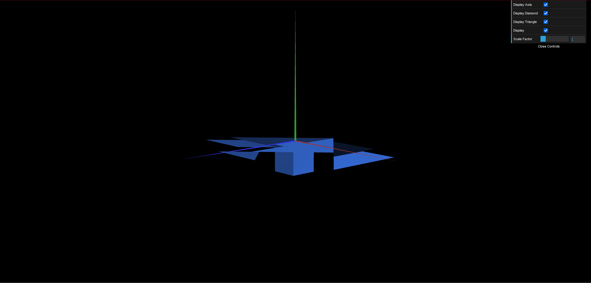

# CG 2022/2023

## Group T04G02

## TP 2 Notes

- No exercício 2 podemos observar o tangram completo. As medições foram feitas a olho tentando cumprir ao máximo a imagem fornecida.

- No exercício 3 conseguimos ver o tangram em cima da base cúbica, cujo canto superior esquerdo está na origem.

- No exercício 4 podemos observar que o cubo criado é ligeiramente diferente do cubo criado anteriormente, devido às suas faces serem criadas separadamente.

