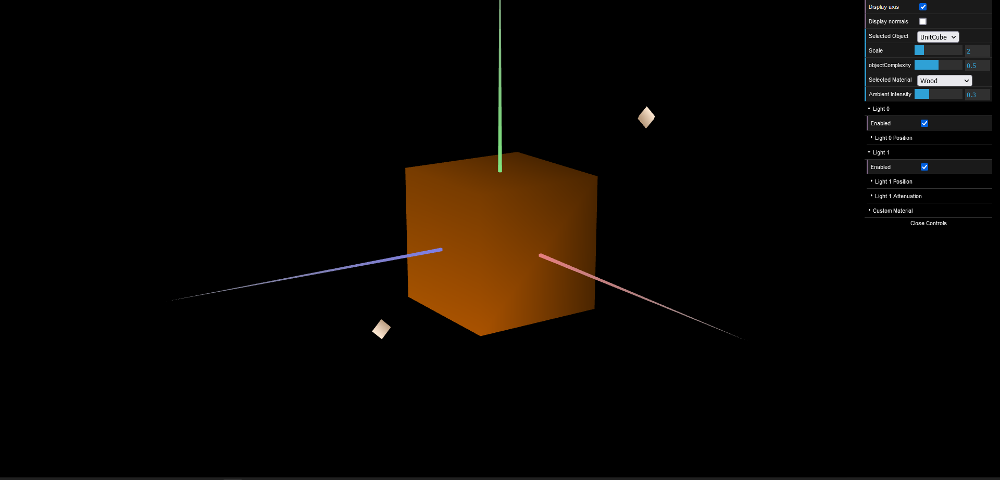
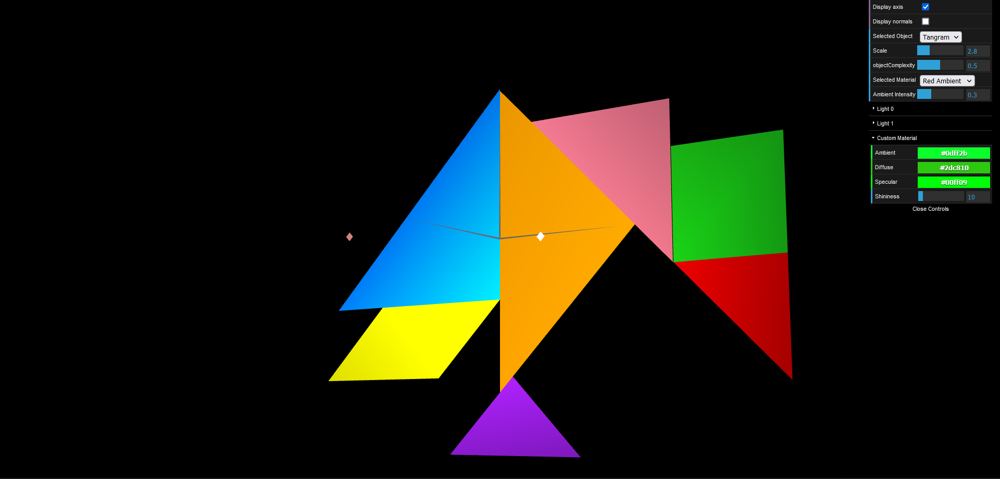
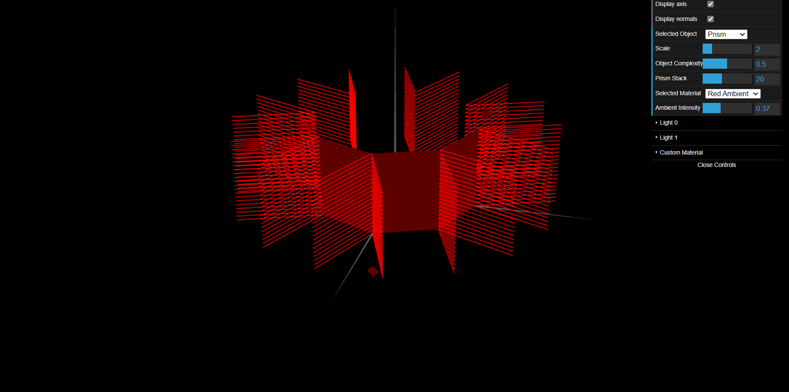
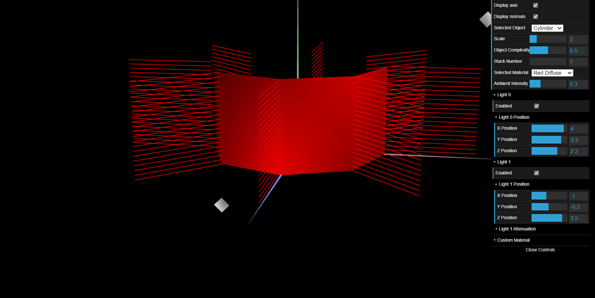

# CG 2022/2023

## Group T04G02

## TP 3 Notes

### Parte 1 - Iluminação e materiais do Tangram

* Nestes exercícios podemos observar MyUnitCube com as normais definidas, e com um material de madeira aplicado.

* Também podemos observar o tangram, criado anteriormente, agora com cores diferentes aplicadas às diferentes formas.

### Parte 2 - Desenho de um prisma

* Como pedido no guião, os vetores normais vão ser perpendiculares à face correspondente, seguindo, por isso, o princípio de "Constant Shading", em que todos os pontos de uma superfície vão ter igual iluminação.

### Parte 3 - Superfície Cilíndrica - Aplicação de Gouraud shading

* Conseguimos observar que a iluminação no cilindro ocorre muito mais suavemente, comparado com o prisma, devido às suas normais e à aplicação de Gouraud shading.

