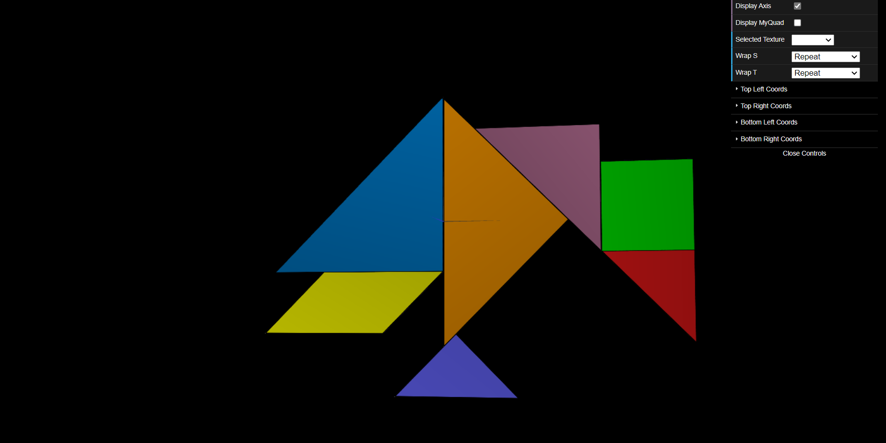
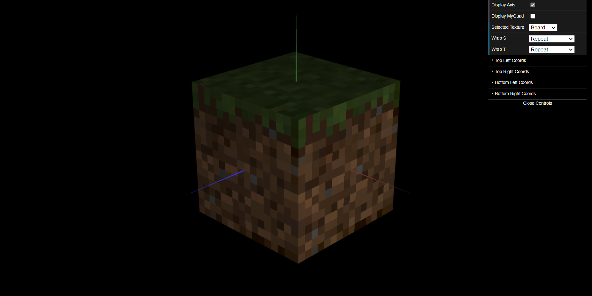

# CG 2022/2023

## Group T04G02

## TP 4 Notes

### 2. Modos de Wrapping de Texturas

* Nesta screenshot, podemos observar o tangram das práticas anteriores, agora com uma textura aplicada. As diferentes formas do tangram vão mapear a textura fornecida de forma diferente para, assim, obtermos cada forma com a sua côr.

* Depois de aplicadas as texturas, conseguimos observar o mine cube.

