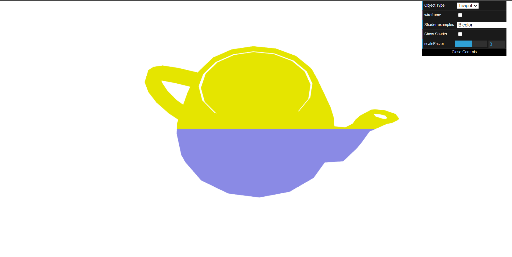
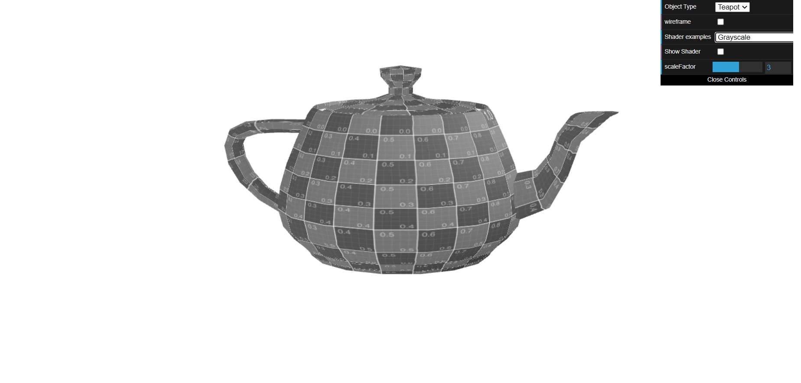
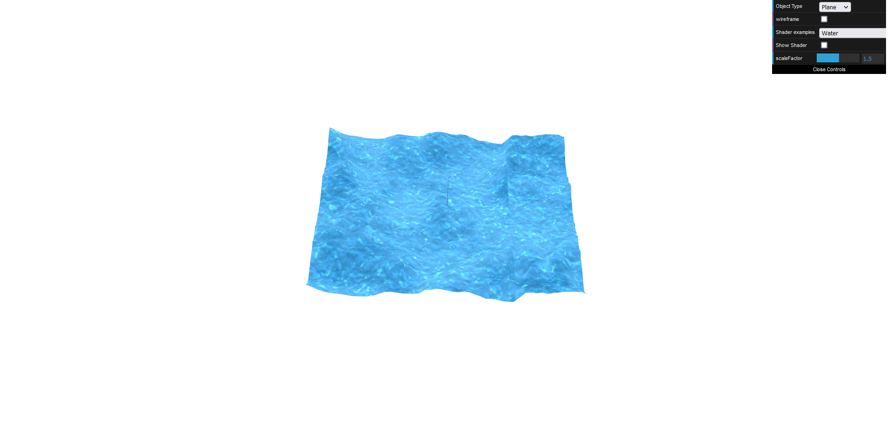

# CG 2022/2023

## Group T04G02

## TP 5 Notes

### 1. Shaders no Teapot

* Podemos observar o teapot na imagem com o novo shader aplicado, que tem diferentes cores de acordo com as coordenadas.

* Conseguimos ver que o shader de grayscale foi aplicado corretamente.

### 2. Shaders no Plane: Efeito de água

* Podemos ver que o efeito de água foi conseguido, sendo que as partes mais escuras do texture map equivalem às zonas mais altas (de acordo com o vídeo disponibilizado como exemplo).

* Conseguimos ver também a animação (o movimento da textura) através deste gif:

